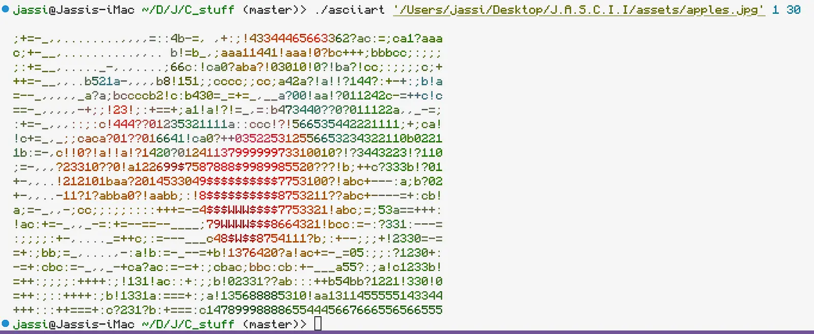

wow first readme, kinda nervous.

> NOTE: line 281-427 in /frontend/index.html were written by an LLM (i am sorry :c)  
> Yes I am Using CoffeeScript And Jquery In 2026, Yes I am Crazy c:

# J.A.S.C.I.I

> Jassi's image (maybe even videos later c: ) to ASCII art program, it uses C for the ASCII generation and _web technology_ for the front end. use it right now
> [by clicking me :)](https://jascii.jassi.dev/)

### Why should i use this?

umm because:

1. It's free :)
2. Your images (and potentially videos in the future) are not going to some random data center so that Zuckerberg can feed it to meta
3. It's freeeeeeeeeeeeee :D
4. Why not?

### How to use

1. Go to the [website](https://jascii.jassi.dev)
2. Simply upload the picture. (Note: Only `.jpg`, `.jpeg`, `.png` & `.gif` [first frame only]  formats are allowed)
3. Ta-da! There you have it.
4. Use the reset button to convert another image to ASCII.
   > NOTE: You Can Download The Repository And Run `build.sh` && `node frontend/scripts/server.js` So That You Can Have A Working Version Of The Website At http://localhost:6969/ (funni number :P )     also the C file has CLI options so you can run:  
   > `./ascii <color (1 for yes, 0 for no)> size`  
   > for example: `./ascii img/img.png 1 150`
   >  
   > 

## Some Examples

A Good Boy  
| Original Image | ASCII art made using `J.A.S.C.I.I` |
| ------------- | ------------- |
|  |  |
|  |  |
|  |  |

> Credits to Sophie for helping with WASM implementation  
> thats it, jassi out :)
